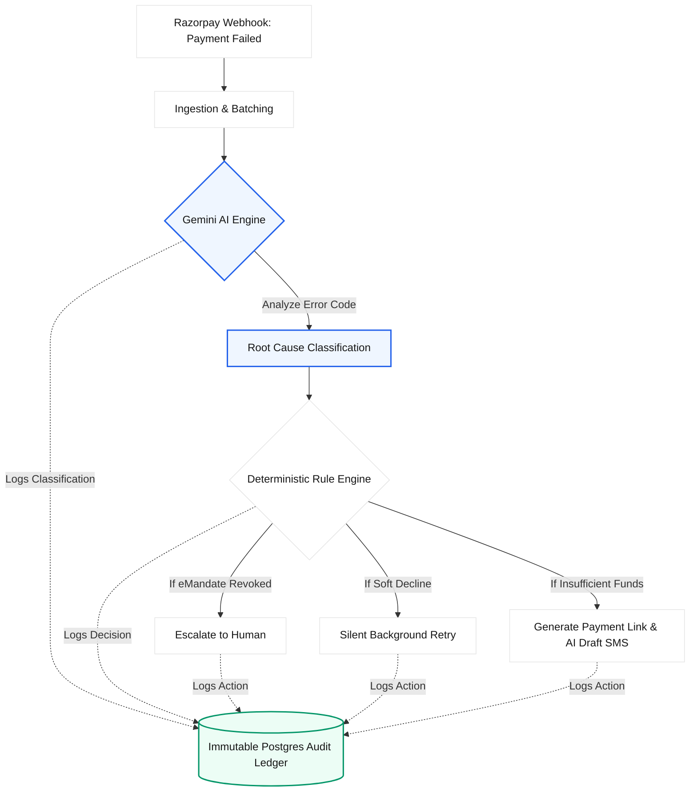

# 🛡️ RevenueGuard AI

**Razorpay AI Buildathon 2026 - Track 03: Autonomous FinTech Agent**

🔗 **[Live Demo on Vercel](#)** *(Replace this with your deployed Vercel link!)*

RevenueGuard AI is an automated, AI-powered payment recovery orchestrator designed to intelligently salvage failed payments while strictly adhering to financial compliance and safety guardrails.

## 🚀 The Problem
When a payment fails (due to insufficient funds, network timeouts, or expired cards), businesses face a manual, disjointed process to recover that revenue. They either lose the customer or resort to blind, rule-based retry spamming that frustrates users and violates compliance policies.

## 💡 Our Solution
RevenueGuard AI sits perfectly between the payment gateway and the customer. It automatically ingests failed transactions, analyzes them using Google Gemini, and executes intelligent recovery strategies—all while maintaining a 100% immutable audit trail.

### System Architecture Flow

### Key Architectural Pillars
1. **Separation of Brain and Muscle**: To prevent AI hallucinations in financial transactions, the system is split into two layers:
   - **AI Classification Layer (Gemini)**: Translates technical, cryptic Razorpay error codes into human-readable root causes.
   - **Deterministic Decision Engine**: Hardcoded business rules that decide the exact action (e.g., auto-retry vs. generating a payment link) based on the AI's classification and the transaction's context.
2. **Strict Stopping Rules**: Before any action is executed, the transaction passes through a mandatory stopping rule check. If a mandate was revoked by the user, or if maximum retries are hit, the system deterministically halts and escalates to a human queue.
3. **Write-Ahead Audit Trail**: Every AI classification, decision, and executed action is logged to an append-only, tamper-proof Postgres database table before it happens.

## 🛠️ Tech Stack
- **Framework:** Next.js 14 (App Router)
- **Database:** Supabase (PostgreSQL) with Row-Level Security and strict constraints
- **AI Engine:** Google Gemini (3.1-flash-lite) for low-latency batch processing
- **Styling:** Custom CSS (No external UI libraries)

## 💻 Running Locally

1. **Clone the repository**
2. **Install dependencies:**
   \`\`\`bash
   npm install
   \`\`\`
3. **Environment Variables:**
   Create a \`.env.local\` file with the following:
   \`\`\`env
   NEXT_PUBLIC_SUPABASE_URL=your_supabase_url
   NEXT_PUBLIC_SUPABASE_ANON_KEY=your_supabase_anon_key
   SUPABASE_SERVICE_ROLE_KEY=your_supabase_service_role
   GEMINI_API_KEY=your_gemini_api_key
   \`\`\`
4. **Database Setup:**
   Run the SQL scripts in \`supabase/migrations/\` in your Supabase SQL Editor to create the required tables, triggers, and append-only constraints.
5. **Start the development server:**
   \`\`\`bash
   npm run dev
   \`\`\`
6. Open [http://localhost:3000](http://localhost:3000) to view the dashboard.

## 📊 How to Test the Demo
1. Navigate to the **Dashboard** and click **Generate 12 Failed Payments** to seed synthetic data.
2. Click **Run Recovery Agent** to process the batch through Gemini and the Decision Engine.
3. View the **AI Root Cause Breakdown** and funnel metrics.
4. Click **View →** on any transaction to see the specific AI-drafted SMS/email.
5. Visit the **Escalations** tab to review payments that hit stopping rules.
6. Visit the **Audit Trail** tab to see the immutable ledger of all operations.
